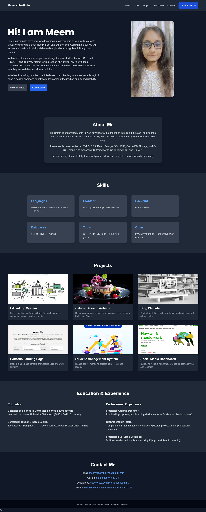

# MyPortfolio

A fully responsive personal portfolio website built using **HTML5**, **Tailwind CSS**, and **modern design principles**.  
This project highlights my skills, projects, education, and professional experience in a visually appealing and accessible way.

---

## 🔹 Features
- **Responsive design** – Works on all devices (desktop, tablet, mobile)  
- **Dark theme with professional styling**  
- **Sections included:**  
  - Hero section with introduction  
  - About Me in a styled card layout  
  - Skills grouped into categories (Languages, Frontend, Backend, Databases, Tools, Other)  
  - Projects with images and descriptions  
  - Education and Professional Experience  
  - Contact details with links  

---

## 🔹 Technologies Used
- **HTML5**  
- **Tailwind CSS** (for responsiveness and modern UI)  

---

## 🔹 Portfolio Content
- **Projects Included:**  
  - E‑Banking System (Django)  
  - Cake & Dessert Website (Django)  
  - Blog Website (Django)  
  - Portfolio Landing Page  
  - Student Management System (Django)  
  - Social Media Dashboard (Node.js + Oracle DB)  

- **Skills:**  
  - **Languages:** HTML5, CSS3, JavaScript, Python, PHP, SQL  
  - **Frontend:** React.js, Bootstrap, Tailwind CSS  
  - **Backend:** Django, PHP  
  - **Databases:** SQLite, MySQL, Oracle  
  - **Tools:** Git, GitHub, VS Code, REST API (basic)  
  - **Other:** MVC Architecture, Responsive Web Design  

- **Education:**  
  - B.Sc. in Computer Science & Engineering (2023–2026, Expected)  
  - Certified in Higher Graphic Design – Government Approved  

- **Experience:**  
  - Freelance Graphic Designer (2 years)  
  - Graphic Design Intern (4 months)  
  - Freelance Full‑Stack Developer (1 month)  

---

## 🔹 Live Demo
*https://nyma-03.github.io/MyPortfolio/*  

---

## 🔹 Contact Me
- **Email:** meemtabassum246@gmail.com  
- **GitHub:** [github.com/Nyma-03](https://github.com/Nyma-03)  
- **Codeforces:** [codeforces.com/profile/Tabassum_3](https://codeforces.com/profile/Tabassum_3)  
- **LinkedIn:** [linkedin.com/in/tabassum-meem-485605267](https://linkedin.com/in/tabassum-meem-485605267)  

---

### How to Run Locally
1. Clone the repository:
2. Navigate to the folder: cd MyPortfolio
3. Open index.html in your browser.

---
© 2025 Naima Tabachchum Meem – All Rights Reserved


   ```bash
   git clone https://github.com/Nyma-03/MyPortfolio.git
